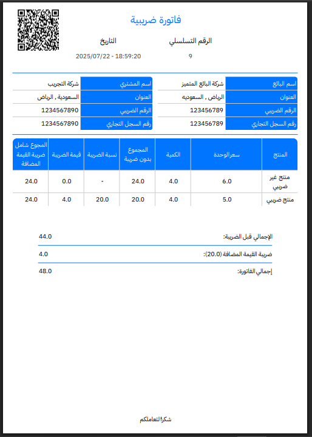

# 🌟 Showcase: FlySales - A Cross-Platform POS System (Desktop & Mobile)

## 🚀 Technologies Used

<p align="center">
  
  
  
  
  
</p>

---

## 🖼️ Project Overview

`FlySales` is an enterprise-grade business management ecosystem, built entirely from scratch and engineered with a **unified Flutter codebase** to deliver a seamless and high-performance user experience across both **Desktop and Mobile** platforms. The goal of this project was not merely to add features, but to engineer a robust, scalable, and maintainable software solution capable of handling complex, real-world business problems. As such, it embodies practical expertise in overcoming challenges like unifying user experience, handling large datasets (big data), real-time synchronization, and dynamic report generation.


### 🎬 Live System Preview


---

## ✨ Core Functional Features

*   **📦 Products & Inventory Module:** Multi-warehouse support, precise stock tracking, unit and barcode management, inventory auditing, and reconciliation.
*   **🔄 Sales & Procurement Cycle:** Complete management of sales invoices, purchases, returns, and quotations convertible into invoices.
*   **🏢 Warehouse Management:** Multi-warehouse support with accurate stock level tracking.
*   **✔️ Inventory Auditing & Reconciliation:** Tools for periodic stock-taking and automatic discrepancy adjustments.
*   **💳 Credit Sales & Payments:** Support for deferred-payment invoices, partial or full settlements, and management of customer/supplier balances.
*   **👥 Employee & Payroll Management:** An integrated system for salaries (daily, weekly, monthly), bonuses, deductions, and advances.
*   **⏰ Shift Management System:** Detailed tracking of each user's shift, cash drawer balance, and end-of-shift closing with discrepancy settlement.
*   **🏦 Cash & Bank Accounts:** Tracking of all financial transactions related to different accounts.
*   **💸 Expense Management:** Recording and categorization of operational expenses.
*   **📈 Financial Accounting:** Journal entries, chart of accounts, and customizable accounting directives.
*   **📊 Smart & Custom Reports:** A comprehensive reporting system with the ability to design custom reports tailored to client needs.

---

## 🛠️ Technical Deep Dive: Challenges & Solutions

This section doesn't just list features; it focuses on the **architectural decisions and engineering solutions** designed to solve real, complex technical problems, highlighting the code's intrinsic value.

### 1. ⚙️ Building a Universal DataGrid Widget

*   **The Challenge:** Developing dozens of screens that display tabular data was a repetitive, time-consuming process that led to an inconsistent user experience and bloated the codebase.
*   **💡 The Engineering Solution:** I designed and developed a central widget, `PaginatedDataTableDemo`, which acts as a micro-framework for data display, based on a **Declarative Approach**.

    **The Result:**
    *   **Reduced development time for new screens by 60%.**
    *   **Unified the UI/UX across 90% of the application.**

    Instead of building each screen from scratch, it is simply defined as a `Screen` object containing all its requirements:
    ```dart
    // Example: Defining the "Client Accounts" screen
    static const Screen clientsAccounts = Screen(
      name: 'client_accounts',
      title: 'clients_accounts',
      query: '''SELECT ... FROM `clients_money` ...''',
      columns: {
        "client_name": [Lang.client_name, 'none', "dfM"],
        "total_rest": [Lang.total_rest, 'none', 'dfM'],
        // ... other columns
      },
    );
    ```
    Then, the central widget is invoked with a single line:
    ```dart
    PaginatedDataTableDemo(
        sc: Screens.clientsAccounts.name,
        // ... other parameters
    )
    ```

    **Detailed Breakdown of the Widget's Components:**

| Parameter          | Description & Explanation                                                                                                                              |
| :----------------- | :------------------------------------------------------------------------------------------------------------------------------------------------------- |
| `sc`               | **Screen Name:** A unique identifier for each screen, used internally to fetch predefined settings like its columns and custom query.                     |
| `key`              | **Global Key:** Allows controlling the widget's state from anywhere in the app, enabling operations like data refresh (`refData`).                          |
| `ops`              | **Operations:** A list of functions that return widgets (e.g., buttons) to be displayed in each row, allowing for record-specific actions.                |
| `listC`            | **Columns List:** **The heart of the widget.** A configuration object describing each column in detail: its title, data source, and special behaviors. |
| `sql`              | **SQL Query:** The specific database query to fetch the data that will be displayed on this screen.                                                        |
| `header`           | **Header:** A custom widget placed at the top of the table, often used for "Add New" buttons or primary filters.                                           |

**The Real Power: The Advanced Column Properties System (`columns`):**  
Each column is defined as an array of 3 elements:  
1.  `"Translation Key"`: The text that will appear as the column header.  
2.  `"Edit Target"`: If the value is `none`, editing is disabled. If it's a table name, it enables inline cell editing, which automatically updates the cache and the database.  
3.  `"Properties"`: A string of characters, where each character represents a property:


| Code | Function                | Explanation                                                                       |
| :--: | :---------------------- | :-------------------------------------------------------------------------------- |
| `H`  | **Hidden (Default)**    | Hides the column by default but allows it to be shown and searched.               |
| `h`  | **Hard Hidden**         | Permanently hides the column from the user (for programmatic use only).           |
| `f`  | **Filterable**          | Includes the column in the advanced search filters.                               |
| `t`  | **Translatable**        | Enables automatic translation of the cell's content.                              |
| `D`  | **Date/Time Formatted** | Automatically formats the value as a "Date/Time" for better readability.          |
| `M`  | **Mobile Visible**      | Marks the column to be automatically visible on smaller screens (Mobile mode).    |

**Calculated Columns:**
To overcome the need to modify complex SQL queries for simple display logic, I added a dynamic column feature where the key starts with `?`. These columns execute a custom Dart function on the row data to display a calculated value, allowing for derived data or conditional styling.

*Example:*
```dart
    // Defining the column in the screen object
    "?status": [Lang.status, funGetInvoiceStatus, "dM"],

    // The function to be executed
    String funGetInvoiceStatus(dynamic dataRow) {
      // ... safe data conversion logic
      final double originalTotal = (rowData['totalaftertax'] as num?)?.toDouble() ?? 0.0;
      final double returnedTotal = (rowData['total_returned'] as num?)?.toDouble() ?? 0.0;
      
      if (returnedTotal > 0 && returnedTotal < originalTotal) {
        return 'Partially Returned';
      } // ... etc.
      return '';
    }
```

---

### 2. 🗃️ Big Data Handling Strategy

*   **The Challenge:** With over a million records, some screens took **~70 seconds** to load, making the application nearly unusable.
*   **💡 The Engineering Solution:** I implemented a multi-layered caching strategy to achieve near-instantaneous response times.

    **The Result:**
    *   **Reduced query response time by 93%, down to under 5 seconds.**

**The Mechanism:**
1.  **Instant Load from Cache:** Upon opening a screen, data is immediately displayed from the local cache (`GetStorage`).
2.  **Incremental Background Fetch:** In the background, the application fetches data from the database in chunks (5000 rows at a time) and updates the cache.
3.  **Smart Invalidation System:** To solve cache coherency issues, I built a smart relationship system that connects the caches. When a client's name is updated, for instance, the system identifies only the screens displaying that name and selectively invalidates their specific caches, instead of rebuilding everything.

    

---

### 3. ⚡ Real-time Sync Across Devices & Branches

*   **The Challenge:** In a multi-user environment, how can we ensure data is instantly updated across all connected devices without overwhelming the server?
*   **💡 The Engineering Solution:** I designed a scalable real-time synchronization infrastructure using a database-level notification layer.

**The Mechanism:**
1.  **Event Logging:** When any operation (create, update, delete) occurs, a "notification" is logged in a dedicated database table, describing the operation type and affected data.
2.  **Notification Broadcast:** Other connected clients are constantly listening for these notifications.
3.  **Smart Update:** Upon receiving a notification, each client triggers its smart update mechanism (leveraging the internal relationship system) to precisely update its local cache or fetch only the new records if it's an addition.
    
    **The Result:**
    *   A full synchronization process takes only **1 to 3 seconds**.
    *   If a user is on a screen that gets updated, they see the change happen **instantly** with no action required.
    *   Offline devices automatically sync themselves upon restarting the application.

---

### 4. 📄 Dynamic JSON to PDF Report Engine

*   **The Challenge:** Commercial reporting tools are expensive (with annual costs up to **$1000**), impose limitations on the developer, and make report customization a complex process.
*   **💡 The Engineering Solution:** I built a strategic report engine from scratch that transforms declarative `JSON` templates into professional `PDF` files using the `pdf` and `printing` libraries.

    **The Result:**
    *   **100% full control** over report design, saving thousands of dollars annually.
    *   **Ability to deploy complex, custom reports in under 24 hours.**

    **The Core JSON Structure:**
    ```json
    {
      "report": { ... }, // Describes the entire layout and structure
      "data": { ... },   // Raw data and variables
      "functions": { ... } // Custom functions (sum, count, calc)
    }
    ```
    **The Engine Supports:**
    -   **Multiple Elements:** Text, images, regular tables, crosstab tables, QR codes, and more.
    -   **Advanced Formatting:** Full control over margins, colors, fonts, borders, and backgrounds.
    -   **Dynamic Data Binding:** Use variables like `{customerName}` and functions like `{totalSales}` directly in the design.

    **Example of the Engine's Programmatic Flow:**
    ```dart
    // 1. Prepare the dynamic data
    Map<String, dynamic> taxInvoiceData = buildTaxInvoiceData(...);

    // 2. Load the report template from a JSON file
    final String templateJson = await rootBundle.loadString("assets/report/tax_invoice.json");
    final Map<String, dynamic> config = json.decode(templateJson);

    // 3. Merge the data with the template
    (config['data'] as Map<String, dynamic>).addAll(taxInvoiceData);

    // 4. Generate the PDF
    ReportGenerator reportGenerator = ReportGenerator(config: config);
    Uint8List pdfBytes = await reportGenerator.generatePdfBytes();
    ```
    

---

## 📞 Contact

<p align="left">
  <a href="mailto:mahmoud.mohammed.dev@gmail.com" target="_blank">
    
  </a>
  <a href="https://www.linkedin.com/in/mahmoud-mohammed-dev" target="_blank">
    
  </a>
  <a href="https://github.com/alpplawymmh" target="_blank">
    
  </a>
</p>
